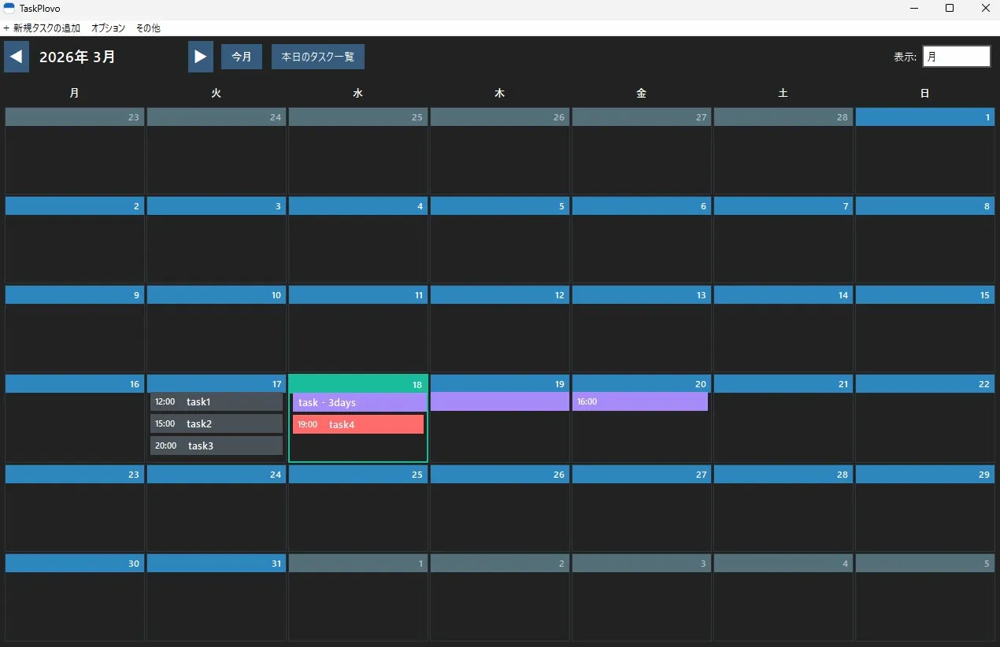
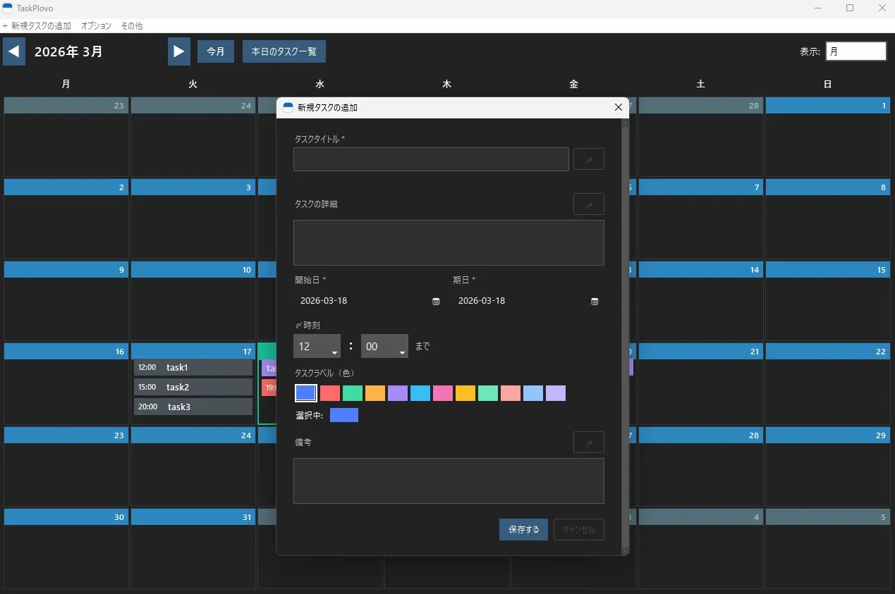
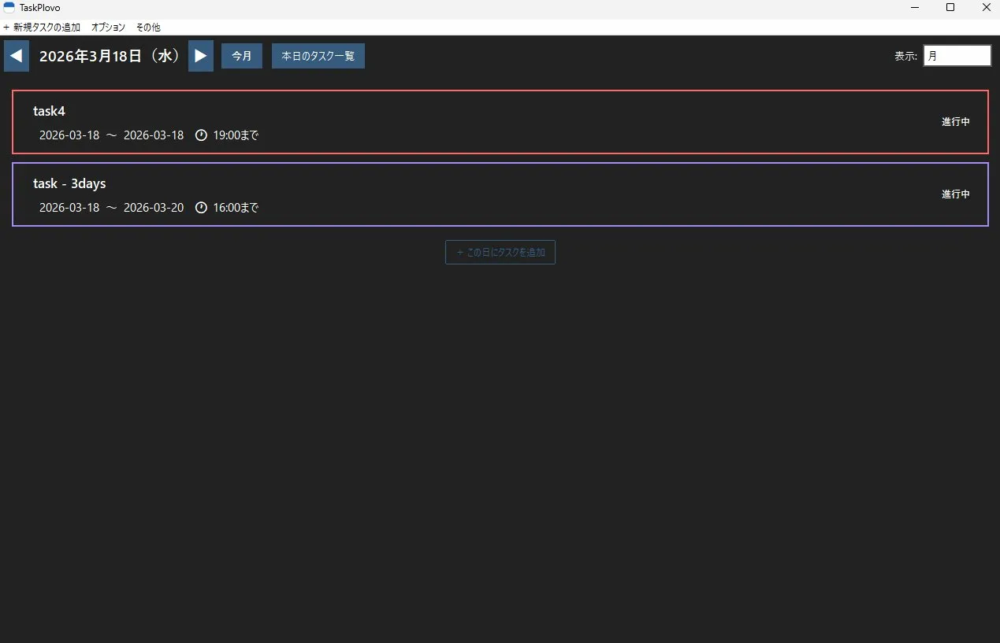
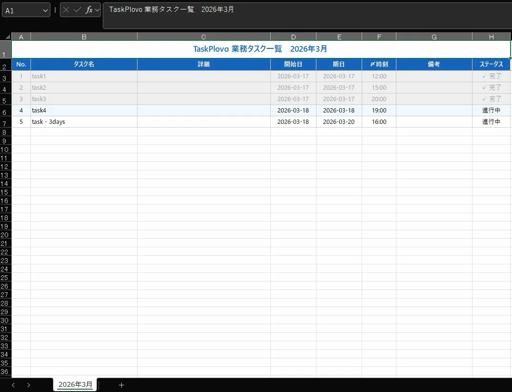
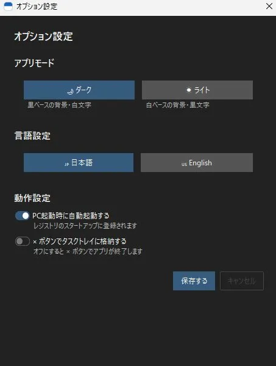

# TaskPlovo 📋

**自分の業務実績を、月単位でExcelに一発出力するWindowsアプリ**

[](LICENSE)
[]()
[]()

---

## 📌 概要

Windows用タスク管理アプリです。自身が担当したタスクを瞬時に月ごとにリストアップして報告用の資料としてExcelに出力できるため、リモートワークや査定時における上司への業務実績の提出用に作成しました。

---

## ✨ 特徴

- 📅 **複数日タスク管理** — 数日にまたがるタスクをまとめて追跡・管理
- 🎤 **音声入力対応** — マイクで話すだけでタスクを追加
- 📊 **Excel出力** — 月ごとのタスク実績を一括エクスポート。煩わしい業務内容報告や査定面談はこれでパスしましょう！
- 🌙 **ダーク / ライトモード** — 目に優しいテーマ切り替え
- 🌏 **多言語対応** — 日本語・英語に対応（i18n）
- 🔔 **システムトレイ常駐** — タスクバーを占有せずバックグラウンドで動作

---

## 📸 スクリーンショット

| カレンダー表示 | タスク追加 |
|:---:|:---:|
|  |  |

| 当日のタスク一覧 | Excel出力結果 |
|:---:|:---:|
|  |  |

<p align="center"></p>

---

## 💾 ダウンロード

| バージョン | ファイル | 備考 |
|-----------|---------|------|
| v1.06 (最新) | [TaskPlovo_v1.06.exe](../../releases/latest) | インストール不要・そのまま起動 |

**動作環境：** Windows 10 / 11（64bit）

---

## 🚀 使い方

1. 上のリンクから `.exe` をダウンロード
2. ダブルクリックで起動（インストール不要）
3. タスクを追加して管理スタート！

> **注意：** 初回起動時にWindowsセキュリティの警告が出る場合があります。「詳細情報」→「実行」をクリックしてください。

---

## 🛠 開発者向け：ソースからビルド

```bash
# リポジトリをクローン
git clone https://github.com/NOSUKE-WORK/TaskPlovo.git
cd TaskPlovo

# 依存パッケージをインストール
pip install -r requirements.txt

# 起動
python main.py

# exeにパッケージング（Windows）
build.bat
```

**必要環境：** Python 3.10以上

---

## ☕ サポート・寄付

TaskPlovoは**無料**で公開しています。  
もし役に立ったと感じていただけたら、開発継続の励みになります 🙏

> 🎁 **[BOOTHで支援する](https://nosuketools.booth.pm/items/8098939)** ← 寄付はこちらから

---

## 📄 ライセンス

このソフトウェアは無償で利用できます。再配布・改変については事前にご相談ください。

---

## 📬 フィードバック・バグ報告

[Issues](../../issues) からお気軽にどうぞ。日本語でOKです。

---

> 🌐 [English README is here](README_EN.md)
