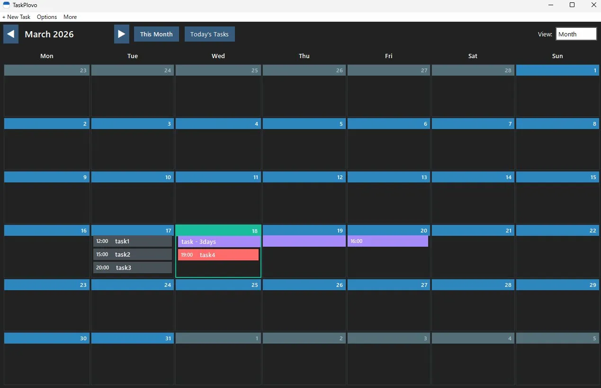
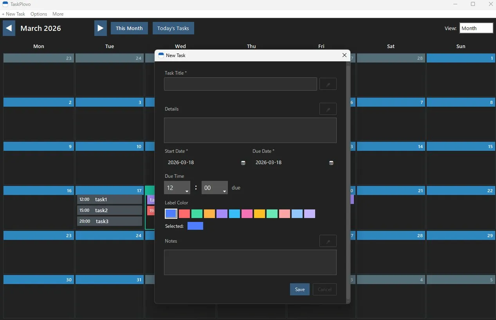
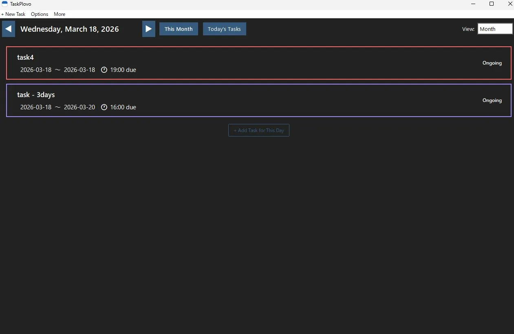
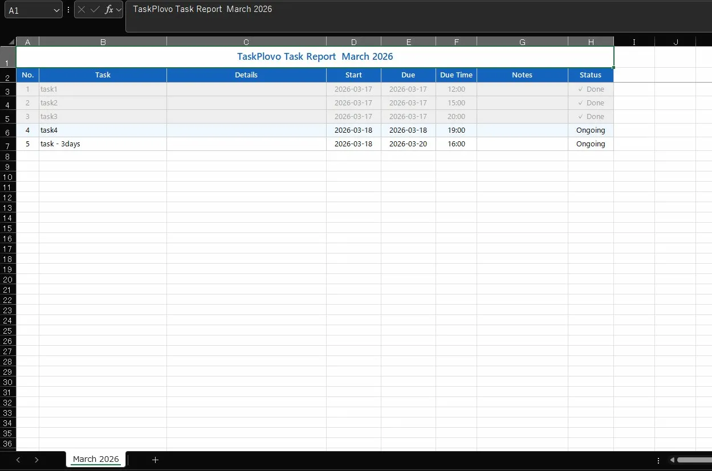
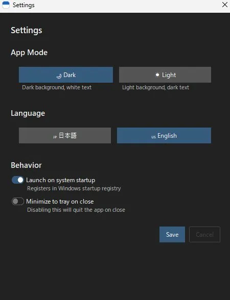

# TaskPlovo 📋

**Export your monthly work achievements to Excel in one click — for Windows**  
**自分の業務実績を、月単位でExcelに一発出力するWindowsアプリ**

[](LICENSE)
[]()
[]()

---

🇺🇸 [English](#english) | 🇯🇵 [日本語](#日本語)

---

<a name="english"></a>
## 🇺🇸 English

### 📌 Overview

TaskPlovo is a Windows task management app built for people who need to report their work to managers — fast. It instantly organizes your tasks by month and exports them as an Excel report, making it perfect for remote workers and performance reviews.

No more spending hours piecing together what you did last month. Just track your tasks daily, and let TaskPlovo do the rest.

### 📸 Screenshots

| Calendar View | Add Task |
|:---:|:---:|
|  |  |

| Daily Task List | Excel Export |
|:---:|:---:|
|  |  |

<p align="center"></p>

### ✨ Features

- 📅 **Multi-day task tracking** — Manage tasks that span multiple days in one place
- 📊 **Excel export** — Export your monthly task history in one click. Nail your performance reviews without the hassle!
- 🎤 **Voice input** — Add tasks hands-free using your microphone
- 🌙 **Dark / Light mode** — Easy on the eyes, day or night
- 🌏 **Multilingual** — Supports Japanese and English (i18n)
- 🔔 **System tray** — Runs quietly in the background without cluttering your taskbar

### 💾 Download

| Version | File | Notes |
|---------|------|-------|
| v1.06 (Latest) | [TaskPlovo_v1.06.exe](../../releases/latest) | No install needed — just run it |

**Requirements:** Windows 10 / 11 (64-bit)

### 🚀 Getting Started

1. Download the `.exe` from the link above
2. Double-click to launch — no installation required
3. Start adding tasks and tracking your work!

> **Note:** Windows may show a security warning on first launch. Click "More info" → "Run anyway" to proceed.

### 🛠 Build from Source

```bash
git clone https://github.com/NOSUKE-WORK/TaskPlovo.git
cd TaskPlovo
pip install -r requirements.txt
python main.py
```

**Requires:** Python 3.10+

### ☕ Support

TaskPlovo is completely **free**.  
If it's been useful to you, consider buying me a coffee — it keeps the project going! 🙏

> 🎁 **[Support on BOOTH](https://nosuketools.booth.pm/items/8098939)**

### 📬 Feedback & Bug Reports

Feel free to open an [Issue](../../issues). English is welcome!

---

<a name="日本語"></a>
## 🇯🇵 日本語

### 📌 概要

Windows用タスク管理アプリです。自身が担当したタスクを瞬時に月ごとにリストアップして報告用の資料としてExcelに出力できるため、リモートワークや査定時における上司への業務実績の提出用に作成しました。

### 📸 スクリーンショット

| カレンダー表示 | タスク追加 |
|:---:|:---:|
|  |  |

| 当日のタスク一覧 | Excel出力結果 |
|:---:|:---:|
|  |  |

<p align="center"></p>

### ✨ 特徴

- 📅 **複数日タスク管理** — 数日にまたがるタスクをまとめて追跡・管理
- 📊 **Excel出力** — 月ごとのタスク実績を一括エクスポート。煩わしい業務内容報告や査定面談はこれでパスしましょう！
- 🎤 **音声入力対応** — マイクで話すだけでタスクを追加
- 🌙 **ダーク / ライトモード** — 目に優しいテーマ切り替え
- 🌏 **多言語対応** — 日本語・英語に対応（i18n）
- 🔔 **システムトレイ常駐** — タスクバーを占有せずバックグラウンドで動作

### 💾 ダウンロード

| バージョン | ファイル | 備考 |
|-----------|---------|------|
| v1.06 (最新) | [TaskPlovo_v1.06.exe](../../releases/latest) | インストール不要・そのまま起動 |

**動作環境：** Windows 10 / 11（64bit）

### 🚀 使い方

1. 上のリンクから `.exe` をダウンロード
2. ダブルクリックで起動（インストール不要）
3. タスクを追加して管理スタート！

> **注意：** 初回起動時にWindowsセキュリティの警告が出る場合があります。「詳細情報」→「実行」をクリックしてください。

### 🛠 開発者向け：ソースからビルド

```bash
git clone https://github.com/NOSUKE-WORK/TaskPlovo.git
cd TaskPlovo
pip install -r requirements.txt
python main.py
```

**必要環境：** Python 3.10以上

### ☕ サポート・寄付

TaskPlovoは**無料**で公開しています。  
もし役に立ったと感じていただけたら、開発継続の励みになります 🙏

> 🎁 **[BOOTHで支援する](https://nosuketools.booth.pm/items/8098939)** ← 寄付はこちらから

### 📬 フィードバック・バグ報告

[Issues](../../issues) からお気軽にどうぞ。日本語でOKです。
